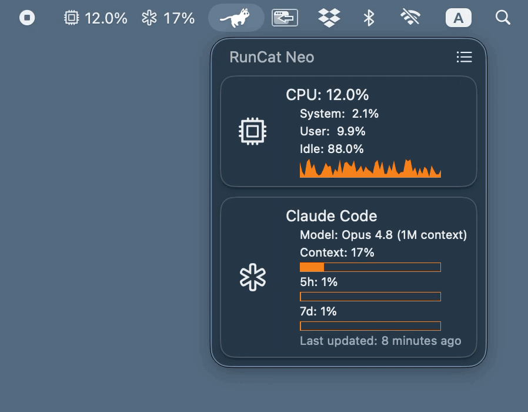

# RunCat Neo

**A cute running cat animation on your macOS menubar.**

> [!CAUTION]
>
> - This project is for macOS, so we do not accept inquiries about Windows version.
> - We do not accept issues or pull requests in languages other than English.
> - Issues that do not follow the Issue Template will be closed without question.

> [!NOTE]
>
> - This project is not the RunCat currently available on the App Store, but a next-generation RunCat being newly developed.
> - It is not intended to be a complete replacement or an upgrade of the existing RunCat, but rather an attempt to implement a new concept.
> - Since it is currently under development for the first release, we do not accept issues or pull requests (PRs) at this time.

`Swift` `macOS` `Xcode` `RunCat`

## 🚧 Installation

~~RunCat Neo is available for installation on the App Store.~~

- Requirement: macOS 26 or higher
- App Store: https://apps.apple.com/us/app/runcat-neo/id6757801838
- Language:
  - Chinese (simplified)
  - Chinese (traditional)
  - English (primary)
  - French
  - German
  - Japanese
  - Korean
  - Russian
  - Spanish
  - Vietnamese

## Requirements

- Development with Xcode 26.5+
- Compatible with macOS 26.3+
- Written in Swift 6.2

## Architecture

This project is built using an architecture called [LUCA](https://github.com/Kyome22/LUCA).  
Please refer to the following article for more details.

https://dev.to/kyome22/luca-a-modern-architecture-for-swiftui-development-3g2i

## Custom Metrics

RunCat can watch any local JSON file in the documented format and render it as a card on the dashboard. Use it to display Claude Code usage, GPU temperature, GitHub contributions, remaining reminders, or anything else you can write to a file.

- [JSON schema](docs/CustomMetricsSchema.md)
- [Claude Code statusLine sample](docs/samples/claude-code/)

## Custom Runners

By creating your own keyframe animations, you can have any runner you like dashing across your menu bar. You can also find resources for custom runners showcased and distributed in the [Runner Gallery](https://runcat-dev.github.io/RunnerGallery/).

## RunCat Developers' Community

This is a space for RunCat contributors to communicate closely regarding development and operations.
We welcome anyone interested in contributing to RunCat.
However, please note that this is a place for discussing features, not for submitting requests.
For requests, please create an Issue according to the template.

Portal: https://runcat-dev.github.io  
Discord: https://discord.gg/wja3mmHt9z

## Contributors

