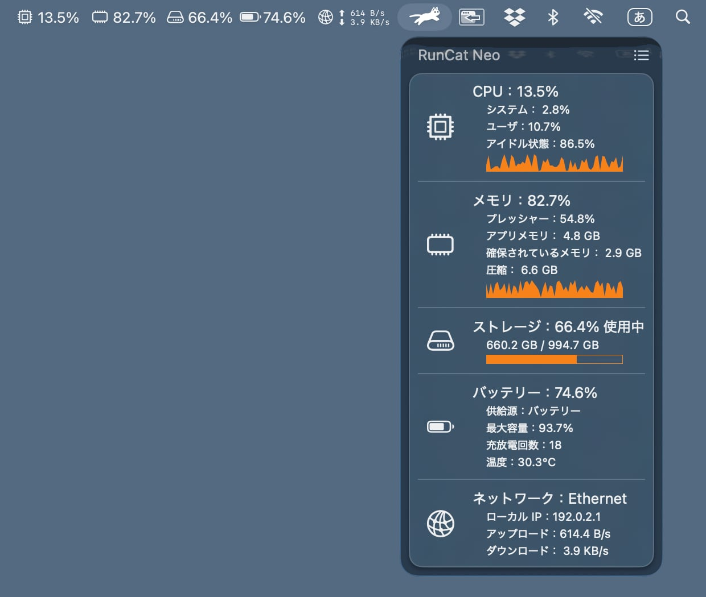

:::header

# RunCat Neo

メニューバーでネコ飼ってみませんか？
:::

ネコの走る速さで Mac の CPU 負荷がわかります。  
メニューバーをちらっと見るだけで十分です。

動作環境：macOS 26 以降 · [GitHub で見る](https://github.com/runcat-dev/RunCatNeo)

## 特長

~ | [~load] | [~metrics] | [~comfort] |
~ | :--- | :--- | :--- |

:::warp load

### ひと目で負荷がわかる

CPU が忙しくなるほどネコは速く走り、落ち着いているときはゆっくり歩きます。数字を読む必要はありません。走る姿を眺めるだけです。
:::

:::warp metrics

### 豊富なシステムメトリクス

CPU、GPU、メモリ、温度、ストレージ、ネットワーク。気になる情報をすべてタスクバーから見守れます。
:::

:::warp comfort

### 生活にささやかな癒しを

作業の合間にふと目に映るだけでちょっとした癒しを提供します。ネコ意外にも素敵なランナーに切り替えられます。
:::

## システムメトリクス

~ | [~metrics-shot] | [~metrics-list] |
~ | :--- | :--- |

:::warp metrics-shot

:::

:::warp metrics-list

メニューバーをクリックして開けるダッシュボードで気になるメトリクスを確認できます。

- CPU 負荷
- メモリプレッシャー
- ストレージ容量
- バッテリー状態
- ネットワーク接続状態

:::

## カスタムメトリクス

~ | [~custom-metrics-shot] | [~custom-metrics-description] |
~ | :--- | :--- |

:::warp custom-metrics-shot

:::

:::warp custom-metrics-description
CPU だけでなく、RunCat Neo は自分で用意した JSON ファイルを監視し、カードとして表示できます。ファイルが変化した瞬間に更新され、ポーリングもネットワーク通信もありません。Claude Code の使用状況、GPU 温度、ビットコインの価格、GitHub のコントリビューションなど、ファイルに書き出せるものは何でも表示できます。

- [JSON スキーマリファレンス](https://github.com/runcat-dev/RunCatNeo/blob/main/docs/CustomMetricsSchema.md)
- [Claude Code statusLine サンプル](https://github.com/runcat-dev/RunCatNeo/tree/main/docs/samples/claude-code)
- [ビットコイン価格サンプル](https://github.com/runcat-dev/RunCatNeo/tree/main/docs/samples/bitcoin)

:::

## カスタムランナー

~ | [~custom-runners-shot] | [~custom-runners-description] |
~ | :--- | :--- |

:::warp custom-runners-shot

:::

:::warp custom-runners-description
ネコが好みでなくても大丈夫。自分でキーフレームアニメーションを用意すれば自作のランナーを走らせられます。

また、[Runner Gallery](https://runcat-dev.github.io/RunnerGallery/)ではカスタムランナー向けのリソースが展示・配布されています。好みのランナーを見つけて使ったり、自慢のランナーを公開してみてはいかがでしょうか？
:::

## よくある質問

:::details 対応している言語は？
RunCat Neo は次の 10 言語に対応しています。英語、日本語、中国語（簡体字・繁体字）、韓国語、フランス語、ドイツ語、スペイン語、ロシア語、ベトナム語。
:::

:::details 既存の RunCat と同じもの？
いいえ。RunCat Neo は、最新の macOS 向けに新しく作られた次世代の RunCat です。既存の RunCat の置き換えやアップグレードではなく、コンセプトを新たに捉え直したものです。
:::

:::details バグ報告や機能リクエストはどこで？
[GitHub リポジトリ](https://github.com/runcat-dev/RunCatNeo)でテンプレートに従って Issue を作成してください。ただしランナーの追加要望だけは例外で、[Runner Gallery](https://runcat-dev.github.io/RunnerGallery/) が窓口になります。開発者同士の議論には、[RunCat Developers コミュニティ](https://runcat-dev.github.io)をご利用ください。
:::

:::details ランナーの追加要望はどこで？
ランナーは RunCat Neo のリポジトリではなく [Runner Gallery](https://runcat-dev.github.io/RunnerGallery/) で管理されています。追加の要望はそちらへお願いします。自作したランナーを共有する場合も同様です。
:::

:::footer
[プライバシーポリシー](./privacy_policy.html?lang=ja) · [GitHub](https://github.com/runcat-dev/RunCatNeo) · [RunCat Developers](https://runcat-dev.github.io)

[English](./) · **日本語**

© 2026 Takuto Nakamura (Kyome22)
:::
