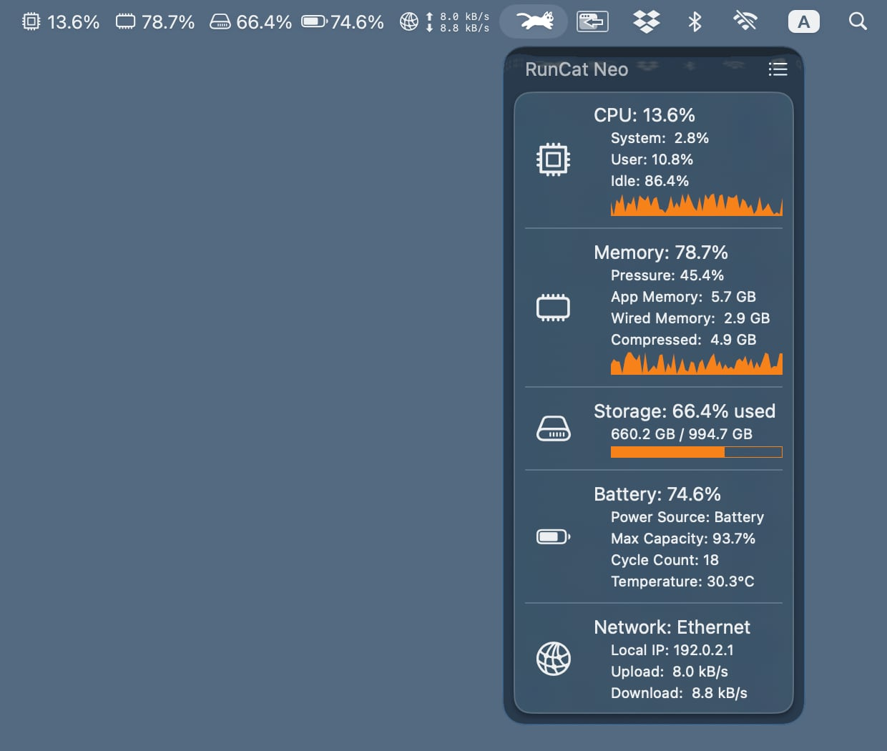

:::header

# RunCat Neo

Cat living in the menubar.
:::

The cat tells you the CPU usage of your Mac by how fast it runs — one glance at the menu bar is all it takes.

Requires macOS 26 or later · [View on GitHub](https://github.com/runcat-dev/RunCatNeo)

## Features

~ | [~load] | [~metrics] | [~comfort] |
~ | :--- | :--- | :--- |

:::warp load

### Load at a glance

The cat speeds up as your CPU gets busier and slows to a stroll when things are calm. No numbers to read — just watch it run.
:::

:::warp metrics

### Rich system metrics

CPU, GPU, memory, temperature, storage, and network — keep an eye on everything that matters right from the taskbar.
:::

:::warp comfort

### Bring a little comfort to your daily life.

Just a quick glance between tasks offers a moment of relaxation. Beyond cats, you can also switch to other wonderful runners.
:::

## System Metrics

~ | [~metrics-shot] | [~metrics-list] |
~ | :--- | :--- |

:::warp metrics-shot

:::

:::warp metrics-list

You can check the metrics you're interested in on the dashboard, which can be opened by clicking the menu bar.

- CPU Usage
- Memory Pressure
- Storage Capacity
- Battery Status
- Network Connectivity

:::

## Custom Metrics

~ | [~custom-metrics-shot] | [~custom-metrics-description] |
~ | :--- | :--- |

:::warp custom-metrics-shot

:::

:::warp custom-metrics-description
Beyond CPU, RunCat Neo can watch a JSON file you maintain and render it as a card — refreshed the moment the file changes, with no polling and no network calls. Track Claude Code usage, GPU temperature, a Bitcoin price, GitHub contributions — anything you can write to a file.

- [JSON schema reference](https://github.com/runcat-dev/RunCatNeo/blob/main/docs/CustomMetricsSchema.md)
- [Claude Code statusLine sample](https://github.com/runcat-dev/RunCatNeo/tree/main/docs/samples/claude-code)
- [Bitcoin price sample](https://github.com/runcat-dev/RunCatNeo/tree/main/docs/samples/bitcoin)

:::

# Custom runners

~ | [~custom-runners-shot] | [~custom-runners-description] |
~ | :--- | :--- |

:::warp custom-runners-shot

:::

:::warp custom-runners-description
Not a cat person? No problem. Prepare your own keyframe animation and run a runner of your own making.

Additionally, the [Runner Gallery](https://runcat-dev.github.io/RunnerGallery/) showcases and distributes resources for custom runners. Why not find a runner you love to use, or even share your own creation with the community?
:::

## FAQ

:::details What languages does it support?
RunCat Neo is available in ten languages: English, Japanese, Chinese (Simplified and Traditional), Korean, French, German, Spanish, Russian, and Vietnamese.
:::

:::details Is this the same as the original RunCat?
No. RunCat Neo is a next-generation RunCat, newly built for modern macOS. It is not a replacement or upgrade of the existing RunCat, but a fresh take on the concept.
:::

:::details Where do I report a bug or request a feature?
Open an Issue on the [GitHub repository](https://github.com/runcat-dev/RunCatNeo) following the template. Requests to add a new runner are the one exception — those belong in the [Runner Gallery](https://runcat-dev.github.io/RunnerGallery/). For contributor discussion, the [RunCat Developers community](https://runcat-dev.github.io) is the place to be.
:::

:::details How do I request a new runner?
Runners are managed in the [Runner Gallery](https://runcat-dev.github.io/RunnerGallery/), not in the RunCat Neo repository. Please make your request there. The same goes for sharing a runner you made yourself.
:::

:::footer
[Privacy Policy](./privacy_policy.html) · [GitHub](https://github.com/runcat-dev/RunCatNeo) · [RunCat Developers](https://runcat-dev.github.io)

**English** · [日本語](./?lang=ja)

© 2026 Takuto Nakamura (Kyome22)
:::
